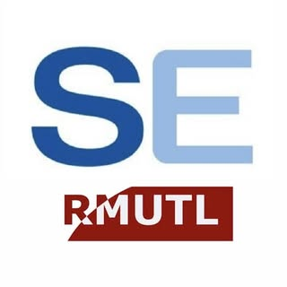

# ENGSE212 Student Project Template — V&V Evidence Portfolio

<p align="center">
  
</p>

> Template สำหรับ repository ของกลุ่มโครงงาน ENGSE212  
> ใช้ทำงานทั้งภาคเรียน และสร้างหลักฐาน V&V ให้สอดคล้องกับรายวิชา ENGSE601

## 1) เริ่มต้นใช้งาน

### วิธี A — ใช้ GitHub Template

1. สร้าง repository ใหม่จาก template นี้
2. ตั้งชื่อเช่น `ENGSE212-2569-Group01-AssetManagement`
3. ตั้ง repository เป็น private หรือ internal ตามนโยบายรายวิชา
4. เพิ่มสมาชิกกลุ่มและอาจารย์ผู้สอนตามสิทธิ์ที่กำหนด
5. แก้ไขส่วน `TODO` ใน README และไฟล์ `docs/00-project-context/PROJECT_CONTEXT.md`

### วิธี B — ใช้ ZIP นี้เป็น local Git repository

```bash
unzip ENGSE212-Student-Project-Template.zip
cd ENGSE212-Student-Project-Template

git remote add origin <URL-REPOSITORY-ของกลุ่ม>
git push -u origin main
```

## 2) หลักคิดการทำงาน

> **One Project, Multiple Evidence**  
> งานพัฒนาจาก ENGSE212 เป็นฐาน แล้วเพิ่มหลักฐาน V&V จาก ENGSE601 โดยไม่ทำเอกสารซ้ำซ้อน

ทุกชิ้นงานควรเชื่อมโยงได้ตามเส้นทาง:

```text
Requirement → Acceptance Criteria → Test Condition → Test Case → Test Result → Defect / Retest → Summary Report
```

## 3) ขั้นตอนที่กลุ่มต้องทำในสัปดาห์แรก

1. เติมข้อมูลโครงงานใน `docs/00-project-context/PROJECT_CONTEXT.md`
2. เพิ่มสมาชิกและบทบาทใน `docs/00-project-context/TEAM.md`
3. ทำ `quality-vv-concept-map.md` ตาม Workshop สัปดาห์ที่ 1
4. อ่าน `docs/08-ai-use/AI_USE_DECLARATION.md` และตกลงกติกา AI ของกลุ่ม
5. commit งานแรกด้วยข้อความที่สื่อความหมาย

```bash
git add .
git commit -m "docs(project): initialize context team and quality goals"
git push origin main
```

## 4) แผนผลงานตาม ENGSE601

| ช่วงเวลา | งาน ENGSE601 | สิ่งที่กลุ่มต้องเพิ่มใน repository นี้ |
|---|---|---|
| W1–W2 | Foundation & Process Models | project context, quality goals, concept map, process map |
| W3–W4 | Testable Requirements / Review / RTM | requirement review sheet, acceptance criteria, RTM v1 |
| W5–W8 | Component / Integration / System / UAT Test Design | test case suite, API/interface tests, UAT scenarios |
| W10–W12 | Test Data / NFR / Reviews / Tools | test data sheet, NFR outline, review records, tool rationale |
| W13–W15 | Test Planning / Defects / Reporting | test plan, defect log, metrics, test summary draft |
| W16 | Portfolio Showcase | complete V&V Evidence Portfolio, AI disclosure, peer review, reflection |

ดูรายละเอียดกิจกรรมจาก [ENGSE601 Course Repository](../ENGSE601-Course-Repository/README.md) หากอยู่ใน bundle เดียวกัน หรือจาก URL repository ที่ผู้สอนประกาศ

## 5) โครงสร้าง Repository

```text
ENGSE212-Student-Project-Template/
├── README.md
├── CONTRIBUTING.md
├── GIT_WORKFLOW.md
├── docs/
│   ├── 00-project-context/
│   ├── 01-requirements/
│   ├── 02-traceability/
│   ├── 03-test-design/
│   ├── 04-test-data/
│   ├── 05-non-functional/
│   ├── 06-defects/
│   ├── 07-test-reports/
│   ├── 08-ai-use/
│   └── 09-reflection/
├── evidence/
│   ├── screenshots/
│   ├── logs/
│   ├── test-runs/
│   └── reviews/
├── src/                       # วาง source code หากใช้ repository เดียวกับโครงงาน
├── templates/
└── .github/
```

## 6) กติกา Git แบบสั้น

- `main` ต้องเป็นเวอร์ชันที่อ่านและตรวจได้
- งานขนาดกลาง/ใหญ่ให้สร้าง branch เช่น `feature/login`, `docs/test-plan`, `fix/coupon-discount`
- ใช้ commit message ที่อ่านรู้เรื่อง เช่น `docs(vv): add RTM v1` หรือ `test(api): add order validation cases`
- เปิด pull request เพื่อรับ peer review เมื่อทำงานสำคัญ
- อย่า commit `.env`, password, API keys หรือข้อมูลส่วนบุคคล

อ่านเพิ่มเติม: [GIT_WORKFLOW.md](GIT_WORKFLOW.md)

## 7) ลิงก์สำคัญของกลุ่ม

| รายการ | URL |
|---|---|
| Project board / issue tracker | TODO |
| Prototype / design board | TODO |
| Deployed system | TODO |
| Test environment | TODO |
| Shared presentation / report | TODO |

## 8) สถานะ V&V Evidence Portfolio

| หลักฐาน | สถานะ | ลิงก์/Path |
|---|---|---|
| Project Context & Quality Goals | ⬜ | `docs/00-project-context/` |
| Requirement Review Sheet | ⬜ | `docs/01-requirements/` |
| RTM | ⬜ | `docs/02-traceability/` |
| Test Plan | ⬜ | `docs/03-test-design/` |
| Test Case Suite | ⬜ | `docs/03-test-design/` |
| Test Data Sheet | ⬜ | `docs/04-test-data/` |
| NFR Test Outline | ⬜ | `docs/05-non-functional/` |
| Defect Log / Retest Evidence | ⬜ | `docs/06-defects/` + `evidence/` |
| Test Summary Report | ⬜ | `docs/07-test-reports/` |
| AI Use Declaration + Reflection | ⬜ | `docs/08-ai-use/` + `docs/09-reflection/` |

---

## Team

| Name | Role | Main Responsibility |
|---|---|---|
| TODO | Product Owner / BA | Requirement and acceptance criteria |
| TODO | Developer | Implementation and component tests |
| TODO | Tester / QA | Test design, execution, defect log |
| TODO | Reviewer / Documentation | Traceability, peer review, report |

> ทีมสามารถหมุนบทบาทได้ แต่ต้องเก็บหลักฐานว่าใครรับผิดชอบงานใด
